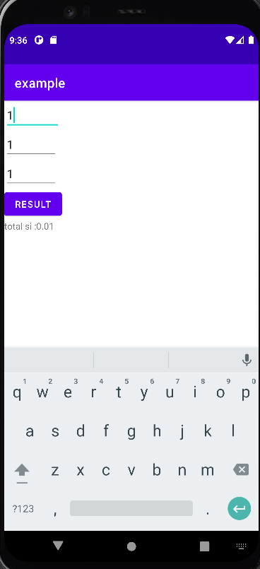

Simple interest is a method to calculate the amount of interest charged on a sum at a given rate and for a given period of time. In simple interest, the principal amount is always the same, unlike compound interest where we add the interest of previous years principal to calculate the interest of the next year.

Simple interest is calculated with the following formula: S.I. = P × R × T, where P = Principal, R = Rate of Interest in % per annum, and T = Time, usually calculated as the number of years. The rate of interest is in percentage r% and is to be written as r/100.

Principal: The principal is the amount that initially borrowed from the bank or invested. The principal is denoted by P.
Rate: Rate is the rate of interest at which the principal amount is given to someone for a certain time, the rate of interest can be 5%, 10%, or 13%, etc. The rate of interest is denoted by R.
Time: Time is the duration for which the principal amount is given to someone. Time is denoted by T.
Amount: When a person takes a loan from a bank, he/she has to return the principal borrowed plus the interest amount, and this total returned is called Amount.
Amount = Principal + Simple Interest

A = P + S.I.

A = P + PRT

A = P(1 + RT)

output :

